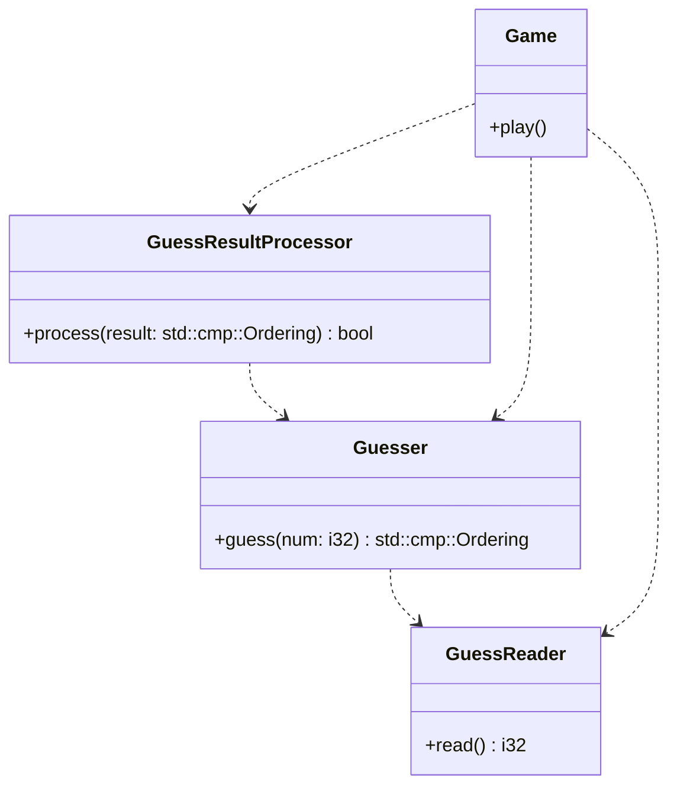

# Guessing Game
Guessing Game (from the Rust Book) by juniorpen01 finished on 11-30-2025 at 10:04 PM. Guesses are from 1 to 100.

## Class Diagram
Hacky class diagram I made. Both somewhat proud and very disappointed by it.
